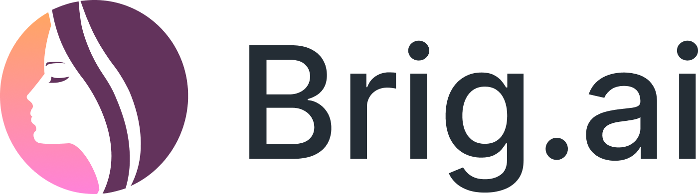
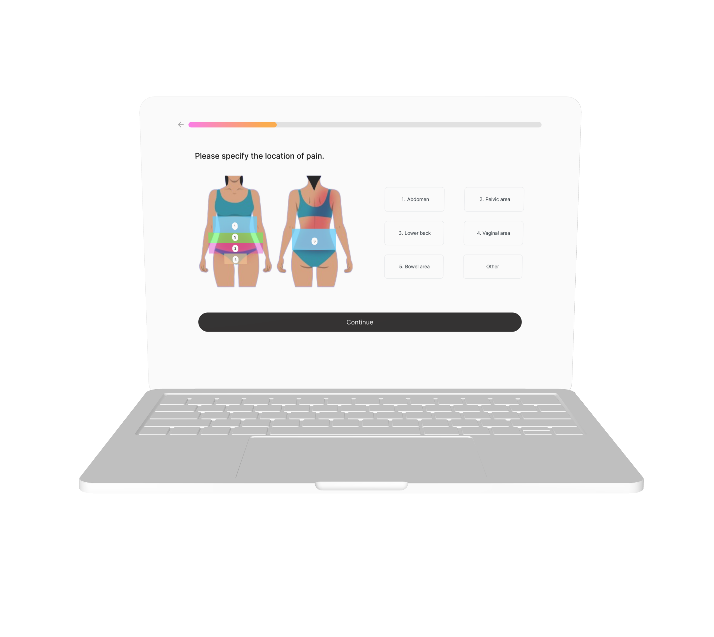

<h1>Brig.ai</h1>

Check it out here: https://brig-ai.vercel.app/results

<b>Bridging the gap between patients and medical professionals</b>

Brig.ai empowers women by providing them with tools and knowledge to advocate for their health, particularly addressing issues like medical dismissal and misdiagnosis in conditions such as PCOS and Endometriosis. We help women understand their symptoms and provide tangible next steps for effective diagnostic tests to self-advocate for with their healthcare providers.

<h2>Problem Statement</h2>

Women are dismissed and misdiagnosed at the symptom-reporting stage due to a lack of awareness, inadequate understanding of reproductive health and medical bias by medical practitioners

<h2>Solution</h2>

With Brig.ai, users are able to fill out a short questionnaire regarding their symptoms and be matched with the most efficient diagnostic tests to seek from a doctor. Brig.ai puts the power into the women's hands, allowing them to self-educate on diagnostic tests and be empowered to advocate in the doctor's office. 

  
  
<h2>Dataset</h2>

In this project, we used two different data sets.

The first dataset consisted of over 800 entries collected from women, both diagnosed and not diagnosed with Endometriosis, who reporting their personal experiences with 56 symptoms most commonly linked to the condition. The data was evenly split between women who have been positively diagnosed with Endometriosis and women who have not. This dataset was retrieved from an article publised on the National Library of Medicine, <i> Self-report symptom-based endometriosis prediction using machine learning</i>.

The second dataset had over 500 entries of both clinical and self-reported symptoms on PCOS. This dataset was retrieved from Kaggle, <i>PCOS dataset</i> by Shreyas Vedpathak and Vaidehi Thakre.

<h3>Data pre-processing</h3>

For both of the datasets, we analyzed the importance of each feature, and removed features that were not contributing to the accuracy of the models. Since the PCOS dataset also included clinical parameters, we removed the features that are not easily reportable by the user without their personal medical data at hand.
  
<h2>Machine Learning Algorithms</h2>

<h3>Logistic Regression</h3>

We trained a logistic regression model on the Endometriosis dataset to predict the likelihood of the condition based on the user's reported symptoms. The model reached an accuracy of around 93% and was implemented into our web app as a means of informing the user the urgency of seeking the endometriosis-related diagnostic tests.

<h3>Adaboost</h3>

We trained an Adaboost model on the PCOS dataset to predict the likelihood of the condition based on the user's reported symptoms.  The model reached an accuracy of around 85% and was implemented into our web app as a means of informing the user the urgency of seeking the PCOS-related diagnostic tests.

<h3>K-means Clustering</h3>

We implemented Kmeans clustering models for both datasets to map symptoms to different groups of diagnostic tests to recommend to users.

